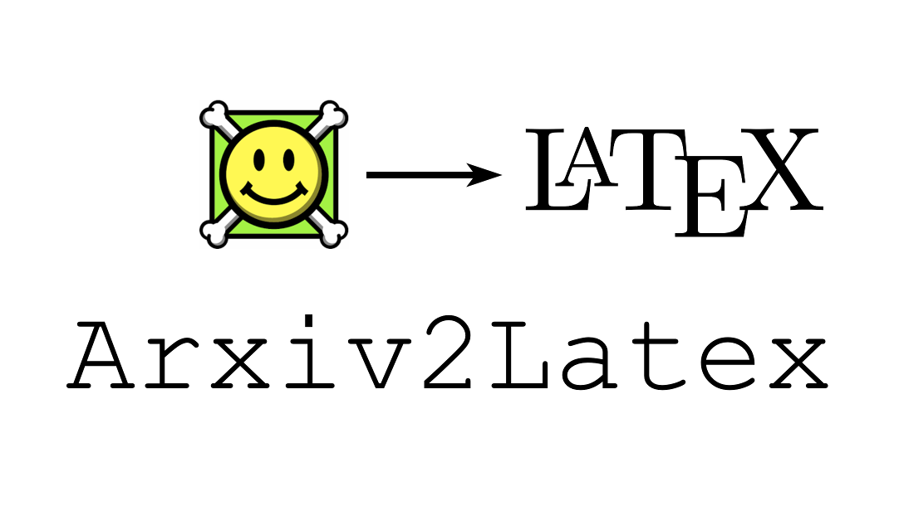

## NEWS
- 2022/12/28: Due to the update of Heroku service, I broguht the Eco Dynos Plan ($5/month, 1000h) to maintain the online API. If you free this tool helpful, some donation would be greatly appreciated!

- BOFA: yqi16766@gmail.com
- wechat pay: please find the QR code [here](#wechatPay)

## About Arxiv2Latex 
- Download the source latex code of multiple arxiv papers with one click. 

## Motivation behind
To facilitate our paper writing, we may usually need to download and copy the latex source code of other's papers. However, this process can become very tedious if there are many papers to download. So I develop this tool to automate this process. I implement it simply with `request` and `tarfile`. To make it as services, I push this project online with the help of `Streamlit` and `Heroku app`. Here is the demo app link: https://arxiv2latex.herokuapp.com/.

## To-do
- [ ] Unlimited download paper number (Solution to download large zip files with `Streamlit`)

## Contribution

Please read the [Contribution Guide](CONTRIBUTION.md). Also feel free to contact me for discussion (yixinliucs@gmail.com). 

## Donation

If you think **Arxiv2Latex** is helpful to you, you can support me here:

Wechat pay

## License
[MIT](https://choosealicense.com/licenses/mit/)
